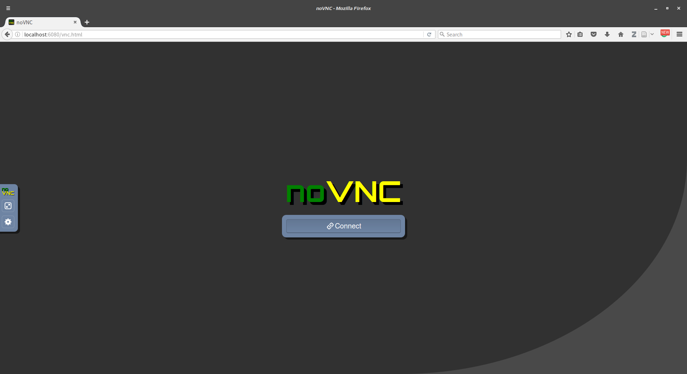
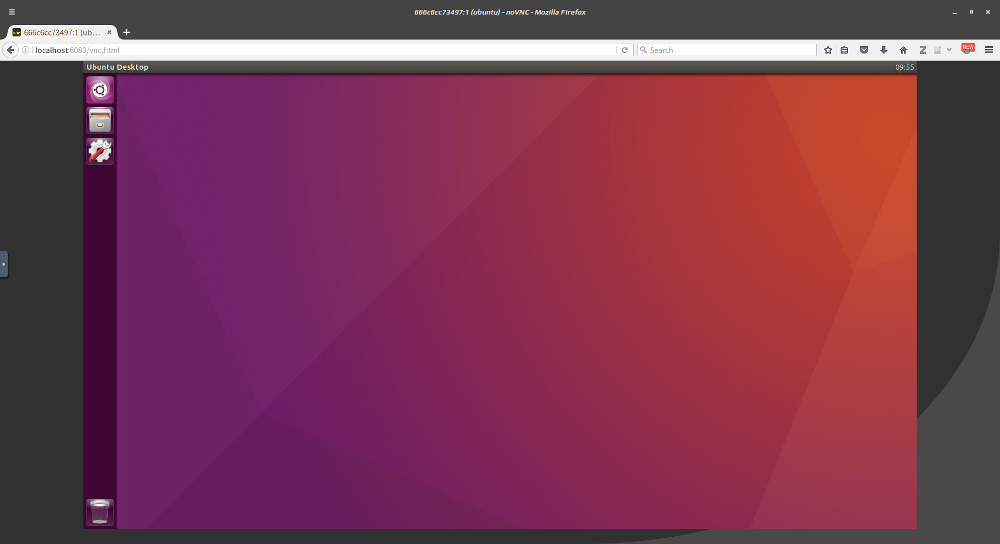
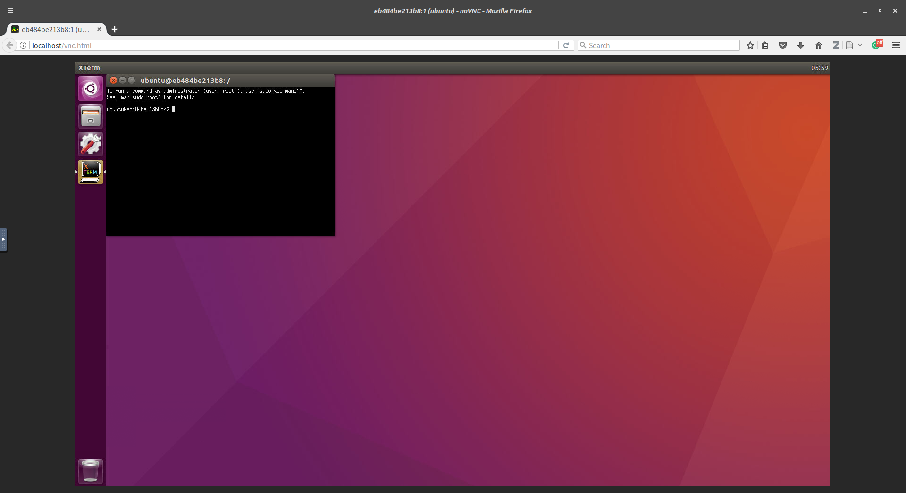

# Docker-Ubuntu-Unity-noVNC

Dockfile for Ubuntu with Unity desktop environment and noVNC. 

This **Image/Dockerfile** aims to create a container for **Ubuntu 16.04** with **Unity Desktop** and using **TightVNCServer**, **noVNC**, **Ngrok(Optional)** which allow user use browser to log in into this container.


## How to use?

You can build this **Dockerfile** yourself:

```
sudo docker build -t "chenjr0719/ubuntu-unity-novnc" .
```

Or, just pull my **image**:

```
sudo docker pull chenjr0719/ubuntu-unity-novnc
```

The default usage of this image is:

```
sudo docker run -itd -p 80:6080 chenjr0719/ubuntu-unity-novnc
```

Wait for a few seconds, then you can access http://localhost/ and see this screen:




### Password

In default, the **password** will create randomly, to find the password, please using the following command:

```
sudo docker exec $CONTAINER_ID cat /home/ubuntu/password.txt
```

And you can use this password to log in into this container.

After log in, you can see this screen:




## Arguments

This image contains 3 input argument:

1. Password

   You can set your own user password as you like:
   ```
   sudo docker run -itd -p 80:6080 -e PASSWORD=$YOUR_PASSWORD chenjr0719/ubuntu-unity-novnc
   ```
   Now, you can user your own password to log in.

2. Sudo

   In default, the user **ubuntu** will not be the sudoer, but if you need, you can use this command:
   ```
   sudo docker run -itd -p 80:6080 -e SUDO=yes chenjr0719/ubuntu-unity-novnc
   ```

   This command will grant the **sudo** to user **ubuntu**.

   And use **SUDO=YES**, **SUDO=Yes**, **SUDO=Y**, **SUDO=y** are also supported.

   To check the sudo is work , when you open **xTerm** it should show following message:
   ```
   To run a command as administrator (user "root"), use "sudo <command>".
   See "man sudo_root" for details.
   ```

   

   **Caution!!** allow your user as sudoer may cause security issues, use it carefully.

3. Ngrok

   [Ngrok](https://ngrok.com/) can be used to deploy localhost to the internet.

   If you need to use this image across the internet, Ngrok is what you need.

   To enable Ngrok, use following command:

   ```
   sudo docker run -itd -p 80:6080 -e NGROK=yes chenjr0719/ubuntu-unity-novnc
   ```

   And find the link address:

   ```
   sudo docker exec $CONTAINER_ID cat /home/ubuntu/ngrok/Ngrok_URL.txt
   ```

   **NGROK=YES**, **NGROK=Yes**, **NGROK=Y**, **NGROK=y** are also supported.

    **Caution!!** this will leave the container open and may cause security issues, use it carefully.


## Screen size

The default setting of screen siz is 1600x900.

You can change screen by using following command, this will change screen size to 1024x768:

```
sudo docker exec $CONTAINER_ID sed -i "s|-geometry 1600x900|-geometry 1024x768|g" /etc/supervisor/conf.d/supervisor.conf
sudo docker restart $CONTAINER_ID
```


## Issues

Can't work properly with gnome-terminal, use XTerm in place of it.

Some components of Unity may not work properly with vncserver.

This is not a full virtual machine of ubuntu, hence please keep in mind that not everything will work inside of it.
